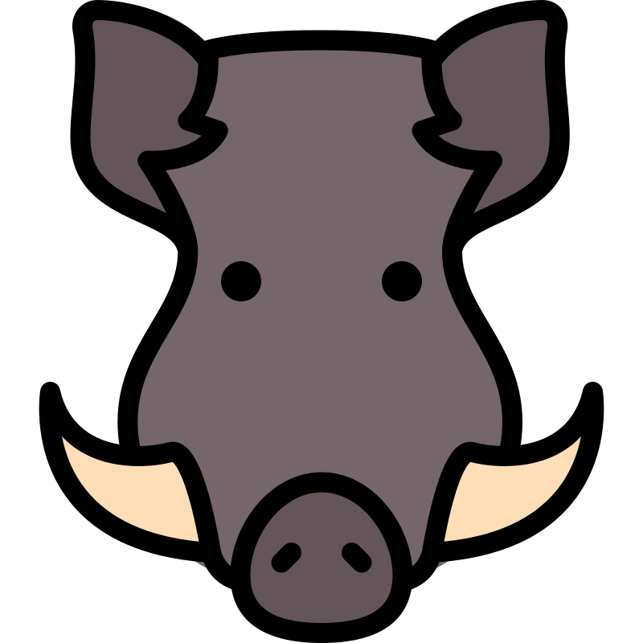

# Kabanchiki

Сначала поднимаем докер композ
Должны быть свободны порты:
- с 8000 по 8006
- 6379
- 5432
- 27017
- 80 (для nginx)
- 443 (для nginx)

`docker compose up --build`

Потом из папки scripts для заполнения тестовых данных.
`python script.py`

